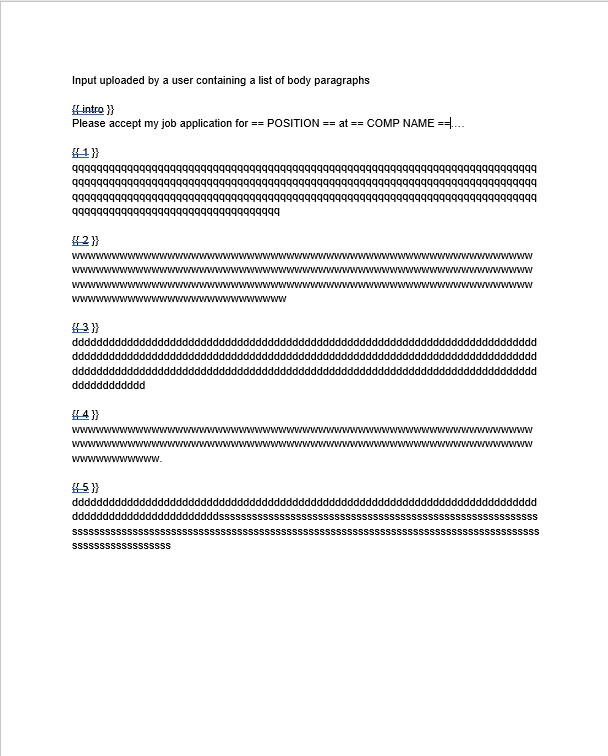
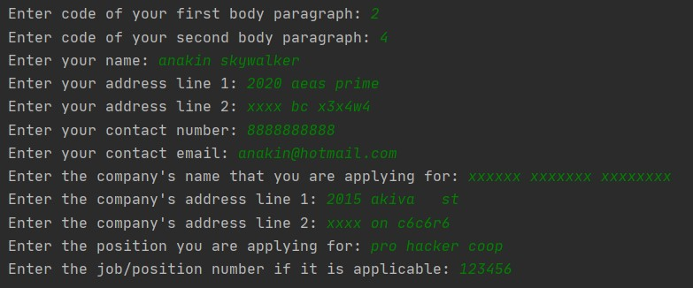
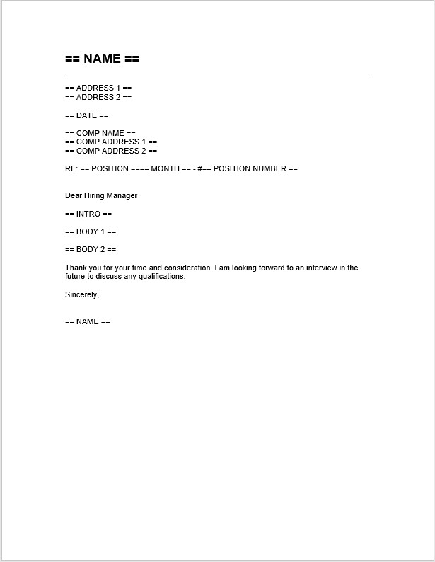
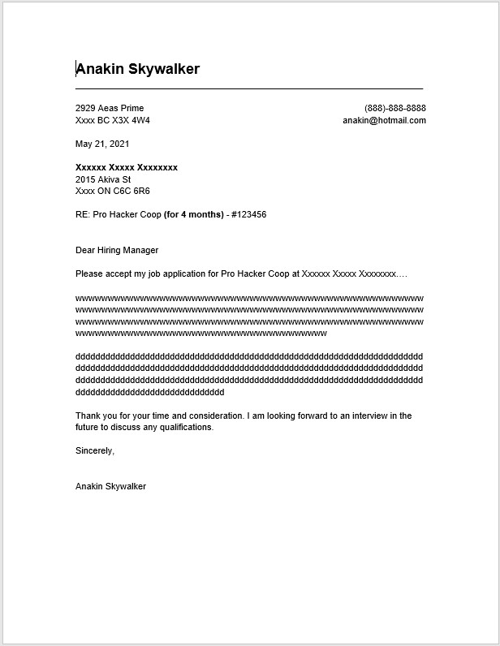

# Cover-Letter-Maker
Cover Letter Maker is an application that generates a cover letter according to the user's input. It means to reduce the amount of time that people spend on constructing a cover letter.

Each year I spend a lot of time writing a cover letter for coop intern. This fact inspires me to come up with a piece of software that can reduce this workload.

## How does Cover Letter Maker works?
1. Ask users to upload a Docx file containing a list of body paragraphs
2. Ask users to a few info needed for their cover letter
3. Extract the info entered by users 
4. Generate some necessary info
5. Format, Beautify and substitute the info into a prepared model
6. Assemble all sections and return a well-done cover letter to users

## Key skills      
* Python
* I/O
* Regex library
* python-docx library
* Datetime

## Upcoming features
This 1st version is a pure python script that is only available for me. However, I am currently working for the 2nd version:
1. Turn this app into a web app by using Flask framework
2. Adding HTML and CSS for UI
3. Deploy it on Heroku 

## Example of inputFile, input, model and result

### InputFile

 
### Input

### Model

### Result
 
